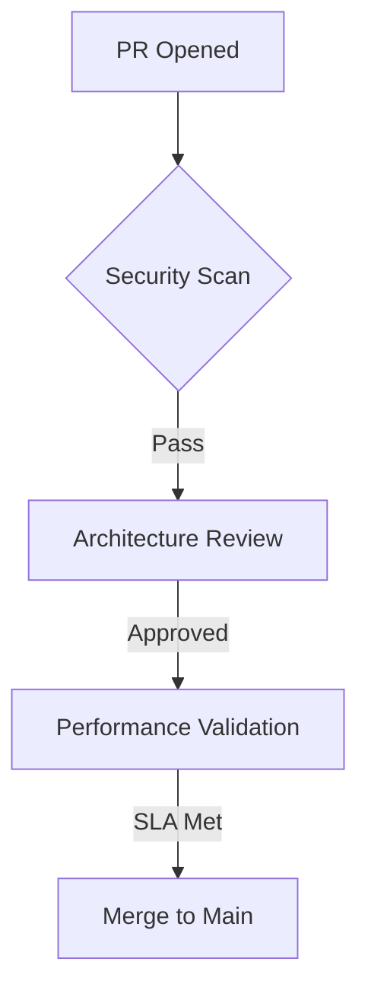

<div align="center">

**Enterprise-Grade Multi-Agent Framework for Distributed AI Systems**  

[](LICENSE)
[](https://github.com/xibra-network/core/actions)
[](https://docs.xibra.network)
[](https://slsa.dev)

</div>

## Connect with us
[](https://twitter.com/XIBRANetwork)
[](https://xibra.network/)


## Table of Contents
- [Architectural Overview](#-architectural-overview)
- [Quick Start](#-quick-start)
- [Core Features](#-core-features)
- [Enterprise Integration](#-enterprise-integration)
- [Development Guide](#-development-guide)
- [Contributing](#-contributing)
- [License](#-license)

---

## 🌐 Architectural Overview

### Technical Matrix
| Component | Protocol Stack | Security | Performance Targets |
|-----------|----------------|----------|---------------------|
| **Hybrid Networking** | ZeroMQ + QUIC + libp2p | TLS 1.3 + WireGuard | <2ms P99 latency |
| **State Management** | CRDTs + Version Vectors | Merkle Proofs | 1M ops/sec |
| **AI Orchestration** | ONNX Runtime + Ray | SGX Enclaves | 100k inferences/sec |
| **Policy Engine** | Rego + Prolog | SPIFFE IDs | 10k decisions/sec |

[View Architecture Diagram](docs/architecture_v3.png)

---

## 🚀 Quick Start

### System Requirements
```bash
# Hardware
CPU: x86_64/ARM64 with AVX-512
GPU: NVIDIA A100/Tesla T4 (CUDA 11.8+)
Memory: 64GB+ ECC RAM

# Software
Docker 24.0+
Kubernetes 1.28+
NVIDIA Container Toolkit
```

### Production Deployment
```bash
# Helm Chart Installation
helm repo add xibra https://charts.xibra.network
helm install xibra-core xibra/xibra \
  --set global.domain=yourcompany.com \
  --set compliance.gdpr.enabled=true \
  --set gpu.nvidia.enabled=true \
  --set monitoring.prometheusEndpoint=https://your-prometheus.com
```

---

## 🔥 Core Features

### Multi-Agent Coordination
```python
from xibra import AgentCluster

cluster = AgentCluster(
    topology="hierarchical-mesh",
    security_profile="zero-trust",
    qos_level=ServiceLevel.SLA_99_999
)

cluster.deploy_agent(
    agent_type="LLM-Coordinator",
    resources={"cpu": 8, "gpu": 1},
    isolation_level=IsolationLevel.HARDENED
)
```

### Secure Computation Enclaves
```rust
// Trusted Execution Environment Setup
let enclave = EnclaveBuilder::new()
    .with_policy("ci/cd.policy.json")
    .with_attestation(AttestationProvider::AzureCVMs)
    .load_wasm("agents/sensitive_logic.wasm")
    .seal_keys(&master_key)
    .deploy()?;
```

---

## 🏢 Enterprise Integration

### Compliance Framework
```yaml
compliance:
  frameworks:
    - gdpr
    - hipaa
    - soc2
  controls:
    data_encryption: 
      at_rest: aes-256-gcm
      in_transit: tls1.3+kyber
    audit: 
      siem: splunk+elastic
      retention: 7years
```

### Cloud Provider Support
| Platform | Networking | Storage | Security |
|----------|------------|---------|----------|
| **AWS**  | VPC Lattice | S3 Intelligent Tiering | IAM Roles Anywhere |
| **Azure**| Virtual WAN | Premium SSD v2 | Confidential VMs |
| **GCP**  | Cross-Cloud Mesh | Hyperdisk ML | Confidential Space |

---

## 🔧 Development Guide

### Build System
```bash
# Cross-Platform Build
make all-platforms \
  BUILD_ARGS="--features cuda,quantum_safe" \
  SIGNING_KEY=$(cat .sigstore.key)
```

### Testing Framework
```python
# Run Compliance Tests
pytest tests/enterprise/ \
  --cov=xibra \
  --cov-report=xml \
  --benchmark-skip \
  --security-scan=trivy,grype
```

---

## 🤝 Contributing

### Code Quality Standards


### Required Checks
- [x] SLSA Level 3 Provenance
- [x] FIPS 140-3 Cryptographic Validation
- [x] NIST AI Risk Framework Assessment
- [x] SIG Store Signed Commits

---

## 📜 License
Apache 2.0 with Enterprise Addendum - [Full Text](LICENSE)

---

## 📞 Contact
**Enterprise Support**: [support@xibra.network](mailto:support@xibra.network)  
**Security Advisories**: [security@xibra.network](mailto:security@xibra.network)  
**Partner Program**: [partners@xibra.network](mailto:partners@xibra.network)
